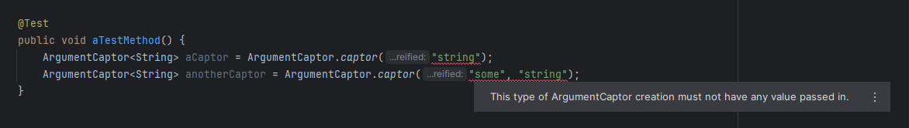

# Argument matching and capture

<!-- TOC -->
* [Inconsistent argument matcher usage](#inconsistent-argument-matcher-usage)
* [Explicit initialization of @Captor field is not required](#explicit-initialization-of-captor-field-is-not-required)
* [@Captor field must be of the type ArgumentCaptor](#captor-field-must-be-of-the-type-argumentcaptor)
* [Generic inferred ArgumentCaptor creation](#generic-inferred-argumentcaptor-creation)
<!-- TOC -->

## Inconsistent argument matcher usage

 [](../src/main/java/com/picimako/mockitools/inspection/InconsistentArgumentMatcherUsageInspection.java)

Argument matchers are used inconsistently (and incorrectly) when, during stubbing, matcher and non-matcher arguments are used in a
mixed manner. That is not permitted by Mockito, and test execution fails when it encounters this problem. As per Mockito documentation:
> If you are using argument matchers, all arguments have to be provided by matchers.

For example, the followings are invalid, and would block test execution.

```java
Mockito.when(mock.method(eq("some string"), 25)).thenReturn(10);
//or
Mockito.when(mock.method("some string", geq(25))).thenReturn(10);
```

The following ways of stubbing are supported by this inspection:
- `Mockito.when()`, `BDDMockito.given()`, `Mockito.do...().when()`, matchers in `AdditionalMatchers`

You can find more information in the official documents and source code:
- [Argument matchers documentation](https://javadoc.io/doc/org.mockito/mockito-core/latest/org/mockito/Mockito.html#argument_matchers)
- [ArgumentMatchers javadoc](https://javadoc.io/static/org.mockito/mockito-core/3.11.2/org/mockito/ArgumentMatchers.html)
- [org.mockito.internal.exceptions.Reporter#invalidUseOfMatchers(int, List)](https://github.com/mockito/mockito/blob/main/src/main/java/org/mockito/internal/exceptions/Reporter.java)
- [org.mockito.internal.exceptions.Reporter#incorrectUseOfAdditionalMatchers(String, int, Collection)](https://github.com/mockito/mockito/blob/main/src/main/java/org/mockito/internal/exceptions/Reporter.java)

### SonarLint

SonarLint also have a rule for this validation: [Mockito argument matchers should be used on all parameters](https://rules.sonarsource.com/java/tag/mockito/RSPEC-6073)

----

## Explicit initialization of @Captor field is not required

 [](../src/main/java/com/picimako/mockitools/inspection/CaptorFieldInitializationInspection.java)

Since `@Captor` annotated fields are initialized automagically by Mockito via `MockitoJUnitRunner`, `MockitoJUnit.rule()` or
`MockitoAnnotations.initMocks()/openMocks()`, there is no need to explicitly initialize them.

This inspection reports `ArgumentCaptor` type `@Captor` fields that have an initializer specified.

```java
public class CaptorTest {

    @Captor
    public ArgumentCaptor<String> captor = ArgumentCaptor.forClass(String.class);
}
```

You can also apply a quick fix (*Remove initializer*) on it, so that the initializer may be removed. The code will then become:

```java
public class CaptorTest {

    @Captor
    public ArgumentCaptor<String> captor;
}
```

----

## @Captor field must be of the type ArgumentCaptor

 [](../src/main/java/com/picimako/mockitools/inspection/CaptorFieldOfTypeArgumentCaptorInspection.java)

Fields that are annotated as `@Captor` must have `ArgumentCaptor` as their type, otherwise Mockito will fail with a message saying the type must be ArgumentCaptor. You can find the corresponding logic in
[org.mockito.internal.configuration.CaptorAnnotationProcessor](https://github.com/mockito/mockito/blob/main/src/main/java/org/mockito/internal/configuration/CaptorAnnotationProcessor.java).

This inspection reports fields that are annotated as `@Captor` but their types are not `ArgumentCaptor`.
It also provides a quick fix (*Convert field type to ArgumentCaptor<>*) to convert the field type to ArgumentCaptor with the appropriate generic type.

```java
//-- arrays --

@Captor
String[] captor; //before
@Captor
ArgumentCaptor<String[]> captor; //after

//-- primitive types --

@Captor
char captor; //before
@Captor
ArgumentCaptor<Character> captor; //after: field type is replaced with its boxed type

//-- types with generic types --

@Captor
List<List<String>> captor; //before
@Captor
ArgumentCaptor<List<List<String>>> captor; //after
```

----

## Generic inferred ArgumentCaptor creation

  [](../src/main/java/com/picimako/mockitools/inspection/captor/GenericInferredCaptorCreationInspection.java)

[Mockito 5.7.0](https://github.com/mockito/mockito/pull/3144) introduced the `ArgumentCaptor.captor()` method
for captor creation, so that the captor type is not determined by the class passed in at creation, instead by the type of the variable/field it is assigned to.

This method throws an exception if objects are passed in, thus this inspection reports calls to this method when it finds at least one such argument.


