# Mock creation

<!-- TOC -->
* [Non-interface type(s) passed into extraInterfaces](#non-interface-types-passed-into-extrainterfaces)
* [No argument is provided for the extraInterfaces() call](#no-argument-is-provided-for-the-extrainterfaces-call)
* [Mockito cannot mock certain types](#mockito-cannot-mock-certain-types)
* [Spying on mock objects](#spying-on-mock-objects)
* [Mock/Spy creation without specifying class](#mockspy-creation-without-specifying-class)
* [Mismatch between mocked type and type of spied instance](#mismatch-between-mocked-type-and-type-of-spied-instance)
* [Mockito/MockedStatic.reset() is used](#mockitomockedstaticreset-is-used)
* [Convert @Mock/@Spy fields to Mockito.mock()/spy() calls](#convert-mockspy-fields-to-mockitomockspy-calls)
* [Convert Mockito.mock()/spy() calls to @Mock/@Spy fields](#convert-mockitomockspy-calls-to-mockspy-fields)
* [Simplify mock creation](#simplify-mock-creation)
* [Expand mock creation](#expand-mock-creation)
<!-- TOC -->

## Non-interface type(s) passed into extraInterfaces

  [](../src/main/java/com/picimako/mockitools/inspection/ExtraInterfacesInspection.java)

When specifying extra interfaces for a mock object (either `@Mock` annotation's `extraInterfaces` attribute, or in `Mockito.withSettings().extraInterfaces()`)
the types must be actual interfaces, otherwise Mockito would stop test execution and fail with an exception letting you know about one of these issues.

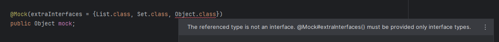

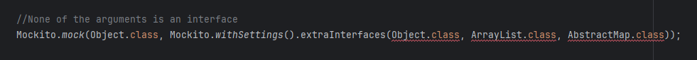

The respective Mockito exceptions are thrown in Mockito's [Reporter.java](https://github.com/mockito/mockito/blob/main/src/main/java/org/mockito/internal/exceptions/Reporter.java),
look for the `extraInterfacesAcceptsOnlyInterfaces(Class)` method.

----

## No argument is provided for the extraInterfaces() call

  [](../src/main/java/com/picimako/mockitools/inspection/ExtraInterfacesInspection.java)

the `MockSettings.extraInterfaces()` method accepts a varargs of `Class` objects, but if there is no argument passed in,
Mockito would stop test execution and fail with an exception letting you know about the problem.

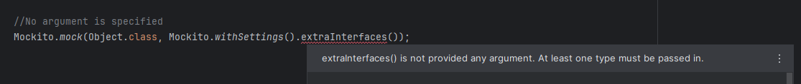

You can find the related Mockito exception handling in its [Reporter.java](https://github.com/mockito/mockito/blob/main/src/main/java/org/mockito/internal/exceptions/Reporter.java),
look for the `extraInterfacesRequiresAtLeastOneInterface()` method.

----

## Mockito cannot mock certain types

### Non-annotation based validation

  [](../src/main/java/com/picimako/mockitools/inspection/MockTypeInspection.java)

Based on Mockito's underlying logic, when attempting to create mocks for primitives, primitive wrapper types, `String` and `Class`, Mockito throws an exception that mock creation cannot happen.

The logic is available in Mockito in [InlineDelegateByteBuddyMockMaker#isTypeMockable(Class)](https://github.com/mockito/mockito/blob/main/src/main/java/org/mockito/internal/creation/bytebuddy/InlineDelegateByteBuddyMockMaker.java)
and [InlineBytecodeGenerator#EXCLUDES](https://github.com/mockito/mockito/blob/main/src/main/java/org/mockito/internal/creation/bytebuddy/InlineBytecodeGenerator.java).

This inspection validates `@Mock` and `@Spy` annotated fields' types and the types specified as the arguments of `Mockito.mock()` and `Mockito.spy()` calls.
The following examples are all non-compliant ones:

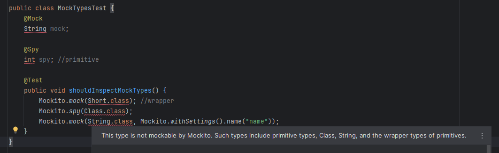

### @DoNotMock-annotated types

  [](../src/main/java/com/picimako/mockitools/inspection/MockTypeInspection.java)

In Mockito 4.1.0 a new `@DoNotMock` annotation was introduced adopted from Google. It has a `reason` attribute to inform users why the type marked with the annotation should not be mocked.

This inspection also marks types based on a `@DoNotMock` annotated type's presence in the type hierarchy. If there is one such type annotated with any annotation whose fully qualified name
ends with `org.mockito.DoNotMock`, be it a custom annotation or Mockito's `org.mockito.DoNotMock`, it is registered.

When constructing the inspection message, the inspection looks for the annotation's `reason` attribute value.

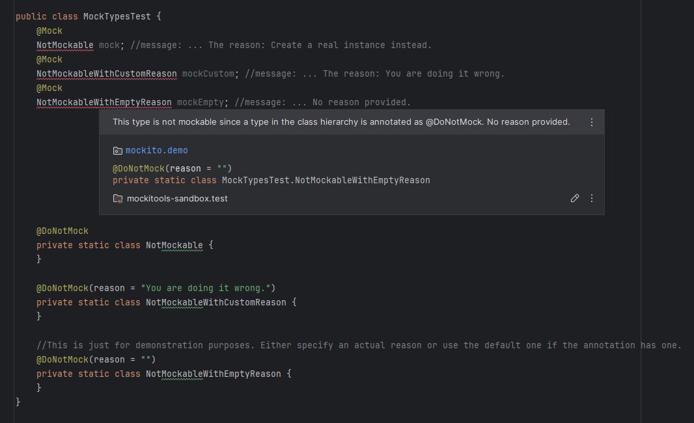

Additional resources:
- [@DoNotMock javadoc](https://javadoc.io/doc/org.mockito/mockito-core/latest/org/mockito/DoNotMock.html)
- [Mockito pull request: Add annotation to mark a type as DoNotMock](https://github.com/mockito/mockito/pull/1833/files)

----

## Spying on mock objects

  [](../src/main/java/com/picimako/mockitools/inspection/SpyOnMockInspection.java)

This inspection reports spy creation on mock objects, for example

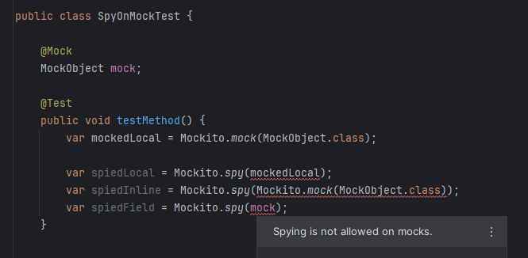

The corresponding feature was introduced in [Mockito 5.4.0](https://github.com/mockito/mockito/releases/tag/v5.4.0), but this inspection does not do a library version check,
and validates test code regardless of the Mockito version.

----

## Mock/Spy creation without specifying class

  [](../src/main/java/com/picimako/mockitools/inspection/mocking/GenericInferredMockAndSpyCreationInspection.java)

[Mockito 4.9.0](https://javadoc.io/doc/org.mockito/mockito-core/latest/org/mockito/Mockito.html#mock_without_class) introduced an enhancement to `Mockito.mock()` and `Mockito.spy()`
based mock/spy creation, so that the mock type is not determined by the class passed in, instead by the type of the variable/field it is assigned to.

These variants of `mock()` and `spy()` throw an exception if objects other than configuration are passed in, thus this inspection reports
these calls when it finds at least one such argument.

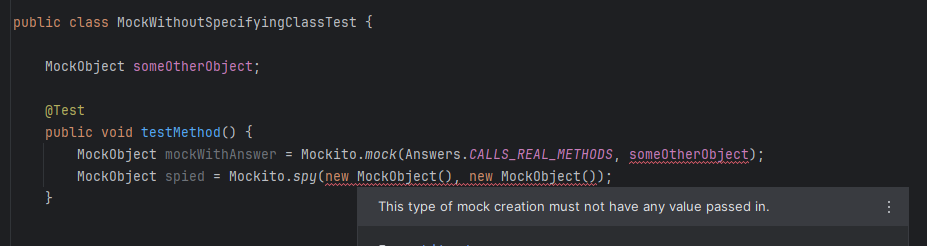

----

## Mismatch between mocked type and type of spied instance

 
[](../src/main/java/com/picimako/mockitools/inspection/MockSpiedInstanceTypeMismatchInspection.java)

This inspection reports when the mocked type and the type of the spied instance don't match in a `mock(Type.class, withSettings().spiedInstance(...));`-type mock creation.
   
Limitations: since validation for all possible cases would need the runtime type of both the mocked type and the
spied instance, the inspection checks the mock creation only when the mock type is a `<type>.class`-type
expression e.g. `SomeObject.class`, and when the spied instance is a 'new' expression e.g. `new SomeObject<>()`.

Based on Mockito's behaviour, in case of mocking/spying type with generic types, only the raw type is taken into account when determining the mismatch.

**Examples:**

```java
class MockSpiedInstanceTypeMismatch {

    void typeComparison() {
        //Matching types - are not reported
        var matchesWithoutGenerics = mock(ArrayList.class, withSettings().spiedInstance(new ArrayList()));
        var matchesWithGenerics = mock(ArrayList.class, withSettings().spiedInstance(new ArrayList<>()));
    
        //Mismatching types - are reported
        var doesNotMatchWithSubType = mock(List.class, withSettings().spiedInstance(new ArrayList<>()));
        var doesNotMatchWithSuperType = mock(SomeType.class, withSettings().spiedInstance(new SuperType()));
        var doesNotMatchWithOtherType = mock(List.class, withSettings().spiedInstance(new HashSet<>()));
    
        //Cases that are not reported due to requiring runtime type
        var doesNotMatchTypeForStaticFactoryMethod = mock(List.class, withSettings().spiedInstance(List.of()));
        var matchesRuntimeType = mock(ArrayList.class, withSettings().spiedInstance(createSpiedInstance()));
        var matchesRawTypes2 = mock(getMockType(), withSettings().spiedInstance(new ArrayList<Boolean>()));
    }
  
    private List<?> createSpiedInstance() {
        var arrayList = new ArrayList<String>();
        //...
        return arrayList;
    }
  
    private Class<ArrayList<String>> getMockType() {
        var strings = new ArrayList<String>();
        return (Class<ArrayList<String>>) strings.getClass();
    }
  
    private static final class SomeType extends SuperType {
    }
  
    private static class SuperType {
    }
}
```

----

## Mockito/MockedStatic.reset() is used

  [](../src/main/java/com/picimako/mockitools/inspection/CallOnMockitoResetInspection.java)

Based on Mockito's documentation on [resetting mocks](https://javadoc.io/doc/org.mockito/mockito-core/latest/org/mockito/Mockito.html#resetting_mocks)

> Smart Mockito users hardly use this feature because they know it could be a sign of poor tests. Normally, you don't need to reset your mocks, just create new mocks for each test method.

This inspection will report any call to `Mockito.reset()` and `MockedStatic.reset()` (since 0.6.0), regardless of its location in the test method.
Although there may be cases when calling `reset()` is acceptable or even necessary, this inspection doesn't take into account those cases.

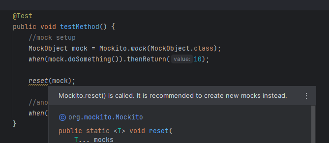

Additional resources:
- [Reflectoring.io - Clean Unit Tests with Mockito](https://reflectoring.io/clean-unit-tests-with-mockito/) (**Avoid Mockito.reset() for Better Unit Tests** section)
- [Stack Exchange - Is this an appropriate use of Mockito's reset method?](https://softwareengineering.stackexchange.com/questions/188299/is-this-an-appropriate-use-of-mockitos-reset-method)

----

## Convert @Mock/@Spy fields to Mockito.mock()/spy() calls

  [](../src/main/java/com/picimako/mockitools/intention/ConvertMockSpyFieldToCallIntention.java)

The [@Mock](https://javadoc.io/doc/org.mockito/mockito-core/latest/org/mockito/Mock.html) and [@Spy](https://javadoc.io/doc/org.mockito/mockito-core/latest/org/mockito/Spy.html)
annotations are an easier way of creating mock and spy objects, and are interchangeable (to a certain degree) with `Mockito.mock()` and `Mockito.spy()` calls.

Thus, this intention provides a means to convert these fields to their Mockito.mock()/spy() variants, also taking into account the `@Mock` annotation's attributes.
It is not available when the field annotated with both `@Mock` and `@Spy`.

In case of converting `@Mock` fields, default attribute values are also ignored and not added to the result `Mockito.mock()` call.

### Determining the target method

If there is only one method in the class, then that one is the target method, otherwise users are able to choose which method to introduce the variable in.

Inner classes are not taken into consideration. Converting the field is possible only within the same class.

The methods in the target selection list are reordered and are always shown in the following order: before hooks, test methods, rest of methods order.
Before hooks and test methods also have dedicated icons for better visual presentation of them.


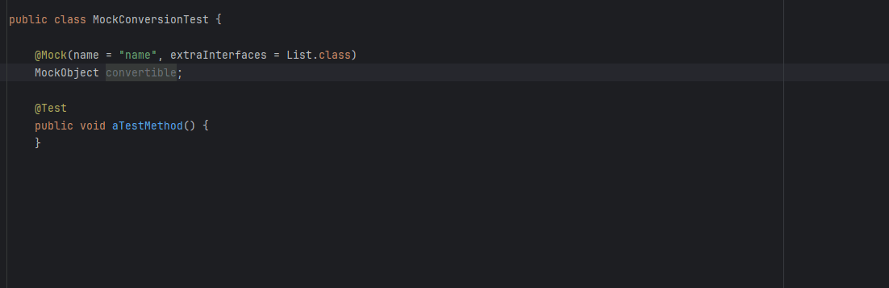

### Examples

Below you can find an extensive list of examples about what is converted into what.

<details>
        <summary><strong>See examples...</strong></summary>

```java
from: @Spy Object spy;
to:   Object spy = Mockito.spy(Object.class);

from: @Spy SpiedObject spy = new SpiedObject();
to:   SpiedObject spy = Mockito.spy(new SpiedObject());

from: @Mock Object mock;
to:   Object mock = Mockito.mock(Object.class);

from: @Mock(extraInterfaces = {}) Object mock;
to:   Object mock = Mockito.mock(Object.class);

from: @Mock(extraInterfaces = List.class) Object mock;
to:   Object mock = Mockito.mock(Object.class, Mockito.withSettings().extraInterfaces(List.class));

from: @Mock(extraInterfaces = {List.class, Set.class}) Object mock;
to:   Object mock = Mockito.mock(Object.class, Mockito.withSettings().extraInterfaces(List.class, Set.class));

from: @Mock(name = "") Object mock;
to:   Object mock = Mockito.mock(Object.class);

from: @Mock(stubOnly = true, name = "") Object mock;
to:   Object mock = Mockito.mock(Object.class, Mockito.withSettings().stubOnly());

from: @Mock(name = "some name") Object mock;
to:   Object mock = Mockito.mock(Object.class, "some name");

from: @Mock(answer = Answers.CALLS_REAL_METHODS) Object mock;
to:   Object mock = Mockito.mock(Object.class, Answers.CALLS_REAL_METHODS);

from: @Mock(stubOnly = true) Object mock;
to:   Object mock = Mockito.mock(Object.class, Mockito.withSettings().stubOnly());

from: @Mock(stubOnly = false) Object mock;
to:   Object mock = Mockito.mock(Object.class);

from: @Mock(serializable = true) Object mock;
to:   Object mock = Mockito.mock(Object.class, Mockito.withSettings().serializable());

from: @Mock(lenient = true) Object mock;
to:   Object mock = Mockito.mock(Object.class, Mockito.withSettings().lenient());

from: @Mock(strictness = Mock.Strictness.WARN) Object mock;
to:   Object mock = Mockito.mock(Object.class, Mockito.withSettings().strictness(Strictness.WARN));

from: @Mock(mockMaker = MockMakers.INLINE) Object mock;
to:   Object mock = Mockito.mock(Object.class, Mockito.withSettings().mockMaker(MockMakers.INLINE));
```

```java
//from:
@Mock(extraInterfaces = List.class, name = "some name")
Object mock;
//to:
Object mock = Mockito.mock(Object.class, Mockito.withSettings().name("some name").extraInterfaces(List.class));
```

```java
//from:
@Mock(name = "some name", extraInterfaces = List.class, answer = Answers.CALLS_REAL_METHODS)
Object mock;
//to:
Object mock = Mockito.mock(Object.class, Mockito.withSettings()
    .name("some name")
    .defaultAnswer(Answers.CALLS_REAL_METHODS)
    .extraInterfaces(List.class));
```

```java
//from:
@Mock(lenient = true, extraInterfaces = {List.class, Set.class}, name = "some name", answer = Answers.CALLS_REAL_METHODS)
Object mock;
//to:
Object mock = Mockito.mock(Object.class, Mockito.withSettings()
    .lenient()
    .name("some name")
    .defaultAnswer(Answers.CALLS_REAL_METHODS)
    .extraInterfaces(List.class, Set.class));
```
</details>

----

## Convert Mockito.mock()/spy() calls to @Mock/@Spy fields


 [](../src/main/java/com/picimako/mockitools/intention/ConvertSpyCallToFieldIntention.java)
 [](../src/main/java/com/picimako/mockitools/intention/ConvertMockCallToFieldIntention.java)

Just like `@Spy` and `@Mock` annotated fields can be converted to `Mockito.spy()` and `@Mockito.mock()` calls, it is true vice versa too.

### Mockito.spy()

This intention is available on `Mockito.spy()` calls, when the argument of the call is either a *new* expression (i.e. `new MockObject()`),
or a class object access expression (i.e. `MockObject.class`), but the argument is not an array creation.

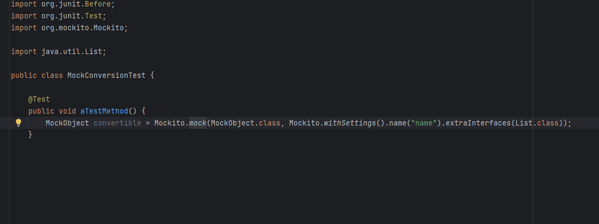

### Examples

```java
from: spy(Clazz.class);
to:   @Spy Clazz clazz;

from: spy(new Clazz());
to:   @Spy Clazz clazz; //initializer ommitted because of using default constructor

from: spy(new Clazz(<arguments>));
to:   @Spy Clazz clazz = new Clazz(<arguments>);

from: spy(new Clazz<typeargs>());
to:   @Spy Clazz<typeargs> clazz;

from: Clazz localVar = spy(Clazz.class);
to:   @Spy Clazz localVar;

from: Clazz localVar = spy(new Clazz());
to:   @Spy Clazz localVar;

from: Clazz localVar = spy(new Clazz(<arguments>));
to:   @Spy Clazz localVar = new Clazz(<arguments>);

from: Clazz<typeargs> localVar = spy(new Clazz<typeargs>());
to:   @Spy Clazz<typeargs> localVar;
```

### Mockito.mock()

This intention is available on `Mockito.mock()` calls, when the Class argument of the call is a class object access expression (i.e. `MockObject.class`),
and in case of the `MockSettings` specific overload, the @Mock annotation supports all configuration specified:
- it starts with the `Mockito.withSettings()` call,
- it doesn't have a call other than to `lenient()`, `stubOnly()`, `defaultAnswer()`, `name()`, `extraInterfaces()`, `mockMaker()`
  or `serializable()`, but not its overloaded variant `serializable(SerializableMode)`.

NOTE: there is no validation on whether the specified name or answer is valid to be put into the annotation attribute (as annotation attributes accept constants only),
the intention is available regardless.

This is mainly to not confuse users when the intention is available and when it is not, and to draw attention to that the attribute values may need adjustment to be used
in the @Mock annotation.

```java
from: mock(Clazz.class)
to:   @Mock Clazz clazz;

from: mock(Clazz.class, "some name")
to:   @Mock(name = "some name") Clazz clazz;

from: mock(Clazz.class, Answers.RETURNS_SMART_NULLS)
to:   @Mock(answer = Answers.RETURNS_SMART_NULLS) Clazz clazz;

from: mock(Clazz.class, Answers.RETURNS_DEFAULTS) //the default answer
to:   @Mock Clazz clazz;

from: mock(Clazz.class, Mockito.withSettings().lenient().serializable())
to:   @Mock(lenient = true, serializable = true) Clazz clazz;

from: mock(Clazz.class, Mockito.withSettings().name("some name"))
to:   @Mock(name = "some name") Clazz clazz;

from: mock(Clazz.class, Mockito.withSettings().defaultAnswer(Answers.RETURNS_SMART_NULLS))
to:   @Mock(answer = Answers.RETURNS_SMART_NULLS) Clazz clazz;

from: mock(Clazz.class, Mockito.withSettings().defaultAnswer(Answers.RETURNS_DEFAULTS)) //the default answer
to:   @Mock Clazz clazz;

from: mock(Clazz.class, Mockito.withSettings().extraInterfaces(List.class))
to:   @Mock(extraInterfaces = List.class) Clazz clazz;

from: mock(Clazz.class, Mockito.withSettings().strictness(Strictness.WARN))
to:   @Mock(strictness = Mock.Strictness.WARN) Clazz clazz;

from: mock(Clazz.class, Mockito.withSettings().mockMaker(MockMakers.INLINE))
to:   @Mock(mockMaker = MockMakers.INLINE) Clazz clazz;
```

Furthermore, the type that is being mocked should be mockable either by Mockito's rules or not being annotated with `@DoNotMock`.

### Naming

- if the `Mockito.spy()`/`Mockito.mock()` call is part of a local variable declaration, then by default will use the variable's name.
If there is already a field with the same name in the target class, a rename refactor is invoked first.
- if the call is not part of a local variable declaration, a rename refactor is invoked first, where the default field name provided is the
mock type's name in lowercase format.

### Target class selection
   
If there is more than one parent class of the selected `spy()`/`mock()` call, a list is shown to select the class the field will be introduced in.

### Support notes

It is not yet supported to convert `spy()` calls in which an already created object is passed:

```java
Clazz clazz = new Clazz();
Clazz spy = Mockito.spy(clazz); 
```

## Simplify mock creation


 [](../src/main/java/com/picimako/mockitools/inspection/mocking/SimplifyMockCreationInspection.java)

This inspection reports `Mockito.mock(..., withSettings()...)` mock creations that have convenience methods
or simpler variants, and provides a quick fix to replace them with their corresponding simpler versions.
This is essentially the opposite direction of what [Expand mock creation](#expand-mock-creation) does. 

Currently `spiedInstance()`, `name()` and `defaultAnswer()` are supported in `MockSettings`.

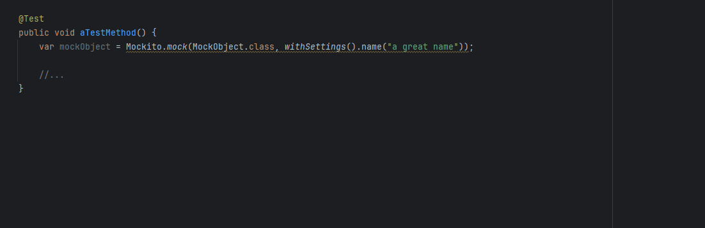

### Examples

```java
from: Mockito.mock(MockObject.class, withSettings().spiedInstance(instance))
  to: Mockito.spy(instance)

from: Mockito.mock(MockObject.class, withSettings().name(name))
  to: Mockito.mock(MockObject.class, name)

from: Mockito.mock(MockObject.class, withSettings().defaultAnswer(answer))
  to: Mockito.mock(MockObject.class, answer)
```

## Expand mock creation


 [](../src/main/java/com/picimako/mockitools/intention/mocking/ExpandMockCreationIntention.java)

This intention action expands certain mock/spy creation calls to use concrete `MockSettings` configuration,
and aims to simplify the process of converting mock creation logic when further mock settings need to be added.
This is essentially the opposite direction of what [Simplify mock creation](#simplify-mock-creation) does.

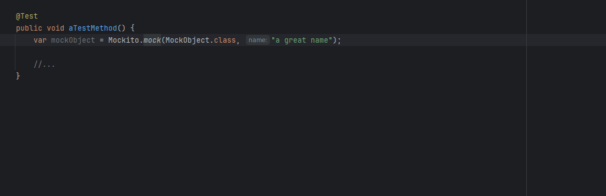

The intention is available on `Mockito.mock()` and `Mockito.spy()` calls, and the following conversions/expansions are supported:

```java
//From:
var spiedInstance = new SpiedType<Object>();
var spy = Mockito.spy(spiedInstance);
//to:
var spy = Mockito.mock(SpiedType.class, withSettings().spiedInstance(spiedInstance));

//From:
Mockito.mock(MockType.class, "some mock name")
//to:
Mockito.mock(MockType.class, withSettings().name("some mock name"))

//From:
Mockito.mock(MockType.class, Answers.RETURNS_MOCKS)
//to:
Mockito.mock(MockType.class, withSettings().defaultAnswer(Answers.RETURNS_MOCKS))
```
