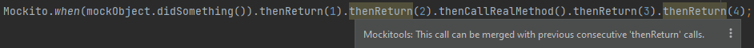

# Stubbing

## Invalid checked exception is passed into *Throw() methods

  [](../src/main/java/com/picimako/mockitools/inspection/ThrowsCheckedExceptionStubbingInspection.java)

Reports exception references in <code>*Throw()</code> stubbing methods based on Mockito's rule on checked exceptions

> If [the specified exception types] contain checked exceptions then they have to match one of the checked exceptions in the method signature.
   
The following constructs are supported:
- `Mockito.when().thenThrow(...)`
- `BDDMockito.given().willThrow(...)`
- `Mockito.doThrow(...).when()`
- `BDDMockito.willThrow(...).given()`
   
In case of each way of stubbing, further chained <code>*Throw()</code> calls are supported too. In case of an empty list, no problem is reported.

**Example:**

```java
void testMethod() {
    MockObject mock = new MockObject();
    // IOException is NOT reported because it is in MockObject#doSomething()'s throws list
    // IllegalArgumentException is NOT reported because it is not a checked exception
    // SqlException IS reported because it is not is in the throws list
    Mockito.doThrow(IOException.class, IllegalArgumentException.class, SqlException.class).when(mock).doSomething();
}

class MockObject {
    void doSomething() throws IOException, ClassNotFoundException {
    }
}
```

## Consecutive `*Return()` and `*Throw()` calls can be merged


 [](../src/main/java/com/picimako/mockitools/inspection/consecutive/SimplifyConsecutiveReturnCallsInspection.java)
 [](../src/main/java/com/picimako/mockitools/inspection/consecutive/SimplifyConsecutiveThrowCallsInspection.java)

Reports multiple consecutive calls to `*Return()` and `*Throw()` methods, respectively, so that they may be merged into a single call.
   
Both `org.mockito.Mockito` and `org.mockito.BDDMockito` based stubbing chains are supported, including calls to
- `doReturn()`, `thenReturn()` and `willReturn()`,
- `doThrow`, `thenThrow()` and `willThrow()`.

If there are multiple sections of consecutive calls within the same call chain, they are reported separately for better notification,
and all sections can be merged separately, depending on the section the quick fix is invoked on. It is always the last consecutive call that is registered.

### Return examples



```java
From: Mockito.when(mockObject.invoke()).thenReturn(1).thenReturn(2);
  to: Mockito.when(mockObject.invoke()).thenReturn(1, 2);

From: Mockito.when(mockObject.invoke()).thenReturn(1).thenCallRealMethod().thenReturn(2).thenReturn(3);
  to: Mockito.when(mockObject.invoke()).thenReturn(1).thenCallRealMethod().thenReturn(2, 3);

From: Mockito.when(mockObject.invoke()).thenReturn(1).thenReturn(2).thenCallRealMethod().thenReturn(3);
  to: Mockito.when(mockObject.invoke()).thenReturn(1, 2).thenCallRealMethod().thenReturn(3);

//caret is on thenReturn(4)
From: Mockito.when(mockObject.invoke()).thenReturn(1, 2, 3).thenReturn(4).thenCallRealMethod().thenReturn(5).thenReturn(6, 7);
  to: Mockito.when(mockObject.invoke()).thenReturn(1, 2, 3, 4).thenCallRealMethod().thenReturn(5).thenReturn(6, 7);

//caret is on thenReturn(6, 7)
From: Mockito.when(mockObject.invoke()).thenReturn(1, 2, 3).thenReturn(4).thenCallRealMethod().thenReturn(5).thenReturn(6, 7);
  to: Mockito.when(mockObject.invoke()).thenReturn(1, 2, 3).thenReturn(4).thenCallRealMethod().thenReturn(5, 6, 7);
```

### Throw examples

When merging `*Throw()` calls, there are a few more cases than in case of `*Return()` ones.

| Argument type combination                               | Quick fix name(s)                                                                                  | Type after conversion                      |
|---------------------------------------------------------|----------------------------------------------------------------------------------------------------|--------------------------------------------|
| `Class` + `Class`                                       | Merge *Throw calls                                                                                 | `Class`                                    |
| `Throwable` + `Throwable`                               | Merge *Throw calls                                                                                 | `Throwable`                                |
| `Class` + 'new' expression with default constructor     | Merge calls, convert parameters to Class objects<br/>Merge calls, convert parameters to Throwables | `Class`<br/>`Throwable`                    |
| `Class` + 'new' expression with non-default constructor | Merge *Throw calls                                                                                 | `Throwable` to keep constructor parameters |

```java
From: Mockito.when(mockObject.invoke()).thenThrow(IllegalArgumentException.class).thenThrow(IOException.class);
  to: Mockito.when(mockObject.invoke()).thenThrow(IllegalArgumentException.class, IOException.class);

From: Mockito.when(mockObject.invoke()).thenThrow(new IllegalArgumentException()).thenThrow(new IOException());
  to: Mockito.when(mockObject.invoke()).thenThrow(new IllegalArgumentException(), new IOException());

From: Mockito.when(mockObject.invoke()).thenThrow(IllegalArgumentException.class).thenThrow(new IOException());
  to (when selecting conversion to Classes):    Mockito.when(mockObject.invoke()).thenThrow(IllegalArgumentException.class, IOException.class);
  to (when selecting conversion to Throwables): Mockito.when(mockObject.invoke()).thenThrow(new IllegalArgumentException(), new IOException());

From: Mockito.when(mockObject.invoke())
        .thenThrow(IllegalArgumentException.class).thenThrow(new IOException("reason")) //caret is here
        .thenReturn(10)
        .thenThrow(IllegalArgumentException.class).thenThrow(IOException.class);
  to: Mockito.when(mockObject.invoke())
        .thenThrow(new IllegalArgumentException(), new IOException("reason"))
        .thenReturn(10)
        .thenThrow(IllegalArgumentException.class).thenThrow(IOException.class);

From: Mockito.when(mockObject.invoke())
        .thenThrow(IllegalArgumentException.class).thenThrow(new IOException("reason"))
        .thenReturn(10)
        .thenThrow(IllegalArgumentException.class).thenThrow(IOException.class); //caret is here
  to: Mockito.when(mockObject.invoke())
        .thenThrow(IllegalArgumentException.class).thenThrow(new IOException("reason"))
        .thenReturn(10)
        .thenThrow(IllegalArgumentException.class, IOException.class);
```

## Convert arguments of `*Throw()` stubbing methods

  [](../src/main/java/com/picimako/mockitools/intention/ConvertThrowStubbingArgumentsIntention.java)

Converts arguments of `*Throw()` stubbing calls from `Type.class` expressions to `new Type()` expressions and vice versa.

The intention is available when either all arguments are `Type.class` style or all are `new Type()` style ones,
and in case of the latter one there is no call to a non-default constructor.

All stubbing approaches are supported:
- `Mockito.when().thenThrow()`
- `BDDMockito.given().willThrow()`
- `Mockito.doThrow().when()`
- `Mockito.do*().doThrow().when()`
- `BDDMockito.willl*).willThrow().given()`
- `BDDMockito.willThrow().given()`

```java
From: Mockito.when(mockObject.doSomething()).thenThrow(new IOException(), new IllegalArgumentException());
  to: Mockito.when(mockObject.doSomething()).thenThrow(IOException.class, IllegalArgumentException.class);

From: Mockito.when(mockObject.doSomething()).thenThrow(IOException.class, IllegalArgumentException.class);
  to: Mockito.when(mockObject.doSomething()).thenThrow(new IOException(), new IllegalArgumentException());
```
