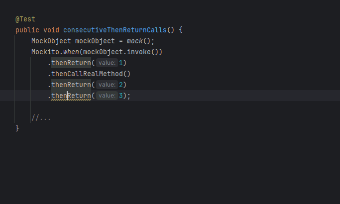
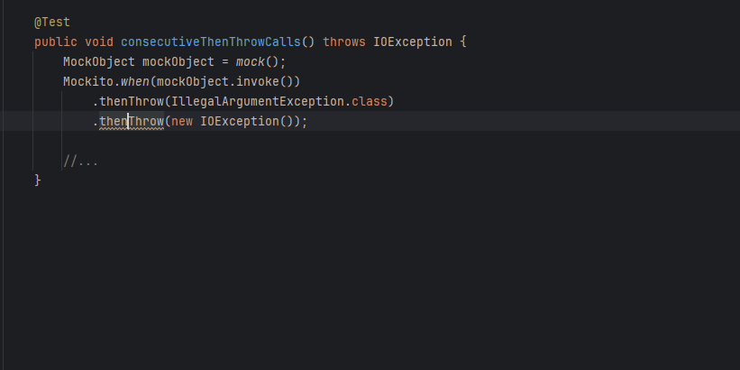
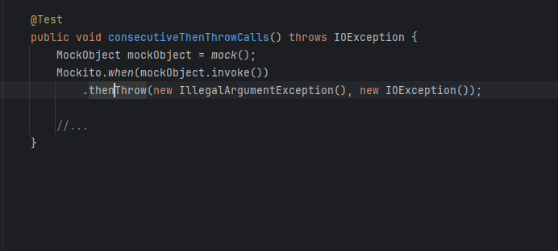
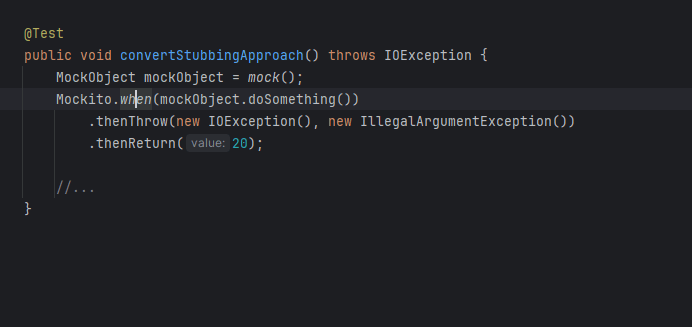
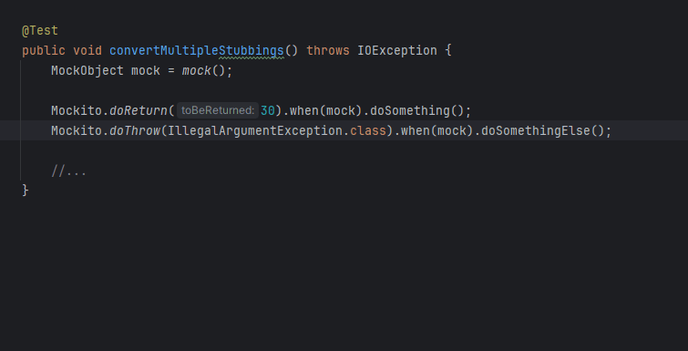
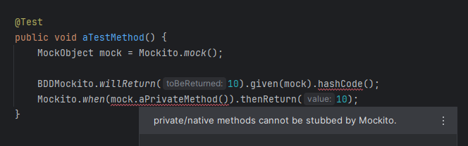

# Stubbing

<!-- TOC -->
* [Invalid checked exception is passed into *Throw() methods](#invalid-checked-exception-is-passed-into-throw-methods)
* [Consecutive `*Return()` and `*Throw()` calls can be merged](#consecutive-return-and-throw-calls-can-be-merged)
* [Stubbing calls and method return type mismatch](#stubbing-calls-and-method-return-type-mismatch)
* [Convert arguments of `*Throw()` stubbing methods](#convert-arguments-of-throw-stubbing-methods)
* [Convert between various stubbing approaches](#convert-between-various-stubbing-approaches)
* [Cannot stub certain methods](#cannot-stub-certain-methods)
<!-- TOC -->

## Invalid checked exception is passed into *Throw() methods

  [](../src/main/java/com/picimako/mockitools/inspection/ThrowsCheckedExceptionStubbingInspection.java)

Reports exception references in `*Throw()` stubbing methods based on Mockito's rule on checked exceptions

> If [the specified exception types] contain checked exceptions then they have to match one of the checked exceptions in the method signature.
   
The following constructs are supported:
- `Mockito.when().thenThrow(...)`
- `BDDMockito.given().willThrow(...)`
- `Mockito.doThrow(...).when()`
- `BDDMockito.willThrow(...).given()`
   
In case of each way of stubbing, further chained `*Throw()` calls are supported too. In case of an empty list, no problem is reported.

A quick fix is also available that adds the reported exception to the `throws` clause of the stubbed method.

**Example:**

```java
void testMethod() {
    MockObject mock = new MockObject();
    Mockito.doThrow(
        IOException.class, //NOT reported because it is in MockObject#doSomething()'s throws list
        IllegalArgumentException.class, //NOT reported because it is not a checked exception
        SqlException.class) //reported because it is not in the throws list
    .when(mock).doSomething();
}

class MockObject {
    void doSomething() throws IOException, ClassNotFoundException {
    }
}
```

## Consecutive `*Return()` and `*Throw()` calls can be merged


 [](../src/main/java/com/picimako/mockitools/inspection/consecutive/SimplifyConsecutiveReturnCallsInspection.java)
 [](../src/main/java/com/picimako/mockitools/inspection/consecutive/SimplifyConsecutiveThrowCallsInspection.java)

Reports multiple consecutive calls to `*Return()` and `*Throw()` methods, respectively, so that they may be merged into a single call.
   
`org.mockito.Mockito`, `org.mockito.BDDMockito` and `org.mockito.MockedStatic` based stubbings are supported, including calls to
- `doReturn()`, `thenReturn()` and `willReturn()`,
- `doThrow()`, `thenThrow()` and `willThrow()`.

If there are multiple sections of consecutive calls within the same call chain, they are reported separately for better notification,
and all sections can be merged separately, depending on the section the quick fix is invoked on. It is always the last consecutive call that is registered.

### *Return examples



**Detailed examples:**
```java
From: Mockito.when(mockObject.invoke()).thenReturn(1).thenReturn(2);
  to: Mockito.when(mockObject.invoke()).thenReturn(1, 2);

From: Mockito.when(mockObject.invoke()).thenReturn(1).thenCallRealMethod().thenReturn(2).thenReturn(3);
  to: Mockito.when(mockObject.invoke()).thenReturn(1).thenCallRealMethod().thenReturn(2, 3);

From: Mockito.when(mockObject.invoke()).thenReturn(1).thenReturn(2).thenCallRealMethod().thenReturn(3);
  to: Mockito.when(mockObject.invoke()).thenReturn(1, 2).thenCallRealMethod().thenReturn(3);

//caret is on thenReturn(4)
From: Mockito.when(mockObject.invoke()).thenReturn(1, 2, 3).thenReturn(4).thenCallRealMethod().thenReturn(5).thenReturn(6, 7);
  to: Mockito.when(mockObject.invoke()).thenReturn(1, 2, 3, 4).thenCallRealMethod().thenReturn(5).thenReturn(6, 7);

//caret is on thenReturn(6, 7)
From: Mockito.when(mockObject.invoke()).thenReturn(1, 2, 3).thenReturn(4).thenCallRealMethod().thenReturn(5).thenReturn(6, 7);
  to: Mockito.when(mockObject.invoke()).thenReturn(1, 2, 3).thenReturn(4).thenCallRealMethod().thenReturn(5, 6, 7);
```

### *Throw examples

When merging `*Throw()` calls, there are a few more cases than in case of `*Return()` ones.

| Argument type combination                               | Quick fix name(s)                                                                                  | Type after conversion                      |
|---------------------------------------------------------|----------------------------------------------------------------------------------------------------|--------------------------------------------|
| `Class` + `Class`                                       | Merge *Throw calls                                                                                 | `Class`                                    |
| `Throwable` + `Throwable`                               | Merge *Throw calls                                                                                 | `Throwable`                                |
| `Class` + 'new' expression with default constructor     | Merge calls, convert parameters to Class objects<br/>Merge calls, convert parameters to Throwables | `Class`<br/>`Throwable`                    |
| `Class` + 'new' expression with non-default constructor | Merge *Throw calls                                                                                 | `Throwable` to keep constructor parameters |



**Detailed examples:**

```java
From: Mockito.when(mockObject.invoke()).thenThrow(IllegalArgumentException.class).thenThrow(IOException.class);
  to: Mockito.when(mockObject.invoke()).thenThrow(IllegalArgumentException.class, IOException.class);

From: Mockito.when(mockObject.invoke()).thenThrow(new IllegalArgumentException()).thenThrow(new IOException());
  to: Mockito.when(mockObject.invoke()).thenThrow(new IllegalArgumentException(), new IOException());

//From:
Mockito.when(mockObject.invoke()).thenThrow(IllegalArgumentException.class).thenThrow(new IOException());
//to (conversion to Classes):
Mockito.when(mockObject.invoke()).thenThrow(IllegalArgumentException.class, IOException.class);
//to (conversion to Throwables):
Mockito.when(mockObject.invoke()).thenThrow(new IllegalArgumentException(), new IOException());
  
//From:
Mockito.when(mockObject.invoke())
  .thenThrow(IllegalArgumentException.class).thenThrow(new IOException("reason")) //caret is here
  .thenReturn(10)
  .thenThrow(IllegalArgumentException.class).thenThrow(IOException.class);
//to:
Mockito.when(mockObject.invoke())
  .thenThrow(new IllegalArgumentException(), new IOException("reason"))
  .thenReturn(10)
  .thenThrow(IllegalArgumentException.class).thenThrow(IOException.class);

//From:
Mockito.when(mockObject.invoke())
  .thenThrow(IllegalArgumentException.class).thenThrow(new IOException("reason"))
  .thenReturn(10)
  .thenThrow(IllegalArgumentException.class).thenThrow(IOException.class); //caret is here
//to:
Mockito.when(mockObject.invoke())
  .thenThrow(IllegalArgumentException.class).thenThrow(new IOException("reason"))
  .thenReturn(10)
  .thenThrow(IllegalArgumentException.class, IOException.class);
```

## Stubbing calls and method return type mismatch

  [](../src/main/java/com/picimako/mockitools/inspection/StubbingAndMethodReturnTypeMismatchInspection.java)

There are two parts to this inspection:
- it reports `doNothing()` and `willDoNothing()` calls when the stubbed method's return type is not void. See Mockito's [corresponding error handling](https://github.com/mockito/mockito/blob/main/src/main/java/org/mockito/internal/exceptions/Reporter.java#L568)
- it reports `*Return()` calls when the stubbed method's return type is void. See Mockito's [corresponding error handling](https://github.com/mockito/mockito/blob/main/src/main/java/org/mockito/internal/exceptions/Reporter.java#L546)

It highlights every instance of `doNothing()`, `willDoNothing()` and `*Return()` calls in the affected call chains.

**doNothing() + not void**

```java
Mockito.doNothing()   //reported
  .doThrow(IllegalArgumentException.class)
  .doNothing()        //reported
  .when(mock).notVoidMethod();

BDDMockito.willThrow(IllegalArgumentException.class)
  .willDoNothing()    //reported
  .given(mock).notVoidMethod();
```

**doReturn() + void**

```java
Mockito.doReturn(10)    //reported
  .doThrow(IllegalArgumentException.class)
  .doReturn(10)         //reported
  .when(mock).voidMethod();
```

## Convert arguments of `*Throw()` stubbing methods

  [](../src/main/java/com/picimako/mockitools/intention/ConvertThrowStubbingArgumentsIntention.java)

Converts arguments of `*Throw()` stubbing calls from `Type.class` expressions to `new Type()` expressions and vice versa.

The intention is available when either all arguments are `Type.class` style or all are `new Type()` style ones,
and in case of the latter one there is no call to a non-default constructor.

All stubbing approaches are supported:
- `Mockito.when().thenThrow()`
- `BDDMockito.given().willThrow()`
- `Mockito.doThrow().when()`
- `Mockito.do*().doThrow().when()`
- `BDDMockito.will*().willThrow().given()`
- `BDDMockito.willThrow().given()`



### Examples

```java
From: Mockito.when(mockObject.doSomething()).thenThrow(new IOException(), new IllegalArgumentException());
  to: Mockito.when(mockObject.doSomething()).thenThrow(IOException.class, IllegalArgumentException.class);

From: Mockito.when(mockObject.doSomething()).thenThrow(IOException.class, IllegalArgumentException.class);
  to: Mockito.when(mockObject.doSomething()).thenThrow(new IOException(), new IllegalArgumentException());
```

## Convert between various stubbing approaches

  

[](../src/main/java/com/picimako/mockitools/intention/convert/stub/ConvertFromBDDMockitoGivenIntention.java)
[](../src/main/java/com/picimako/mockitools/intention/convert/stub/ConvertFromBDDMockitoWillIntention.java)
[](../src/main/java/com/picimako/mockitools/intention/convert/stub/ConvertFromMockitoDoIntention.java)
[](../src/main/java/com/picimako/mockitools/intention/convert/stub/ConvertFromMockitoWhenIntention.java)

There are a couple of ways one can approach stubbing in Mockito, including ways via `org.mockito.Mockito` and `org.mockito.BDDMockito`.

These intentions can convert between each approach if they satisfy the following criteria:
- if the conversion is between `org.mockito.Mockito` and `org.mockito.BDDMockito` stubbings,
  and the ['Enforce conventions' inspection](conventions.md#enforce-orgmockitomockito-over-orgmockitobddmockito-and-vice-versa) doesn't enforce
  the stubbing the user converts from,
- call chains containing `then()`/`will()` or `doNothing()`/`willDoNothing()` calls can be converted only to approaches that support these methods,
- when converting from `Mockito.do*().when()` or `BDDMockito.will*().given()` the `when()`/`given()` calls and the sequent method calls have to be present.

Below you can see which approaches support which methods and where their respective intention actions, to convert from them, are available:

| Mockito.when()         | Mockito.do*()         | BDDMockito.given()      | BDDMockito.will*()      |
|------------------------|-----------------------|-------------------------|-------------------------|
| `thenReturn`           | `doReturn`            | `willReturn`            | `willReturn`            |
| `thenThrow`            | `doThrow`             | `willThrow`             | `willThrow`             |
| `thenAnswer`           | `doAnswer`            | `willAnswer`            | `willAnswer`            |
| `thenCallRealMethod`   | `doCallRealMethod`    | `willCallRealMethod`    | `willCallRealMethod`    |
| `then`                 |                       | `will`                  | `will`                  |
|                        | `doNothing`           |                         | `willDoNothing`         |
| available at: `when()` | available at: `do*()` | available at: `given()` | available at: `will*()` |

Below you can see the details of the conversion directions when converting single stubbings. Bulk conversions are handled and detailed separately.

| Conversion from              | Options by default                                                 | Options when `org.mockito.Mockito` is enforced | Options when `org.mockito.BDDMockito` is enforced |
|------------------------------|--------------------------------------------------------------------|------------------------------------------------|---------------------------------------------------|
| `Mockito.when()`             | `Mockito.when()`<br/>`BDDMockito.given()`<br/>`BDDMockito.will*()` | `Mockito.do*()`                                | `BDDMockito.given()`<br/>`BDDMockito.will*()`     |
| `Mockito.do*().when()`       | `Mockito.when()`<br/>`BDDMockito.given()`<br/>`BDDMockito.will*()` | `Mockito.when()`                               | `BDDMockito.given()`<br/>`BDDMockito.will*()`     |
| `BDDMockito.given().will*()` | `Mockito.when()`<br/>`BDDMockito.given()`<br/>`BDDMockito.will*()` | `Mockito.when()`<br/>`Mockito.do*()`           | `BDDMockito.will*()`                              |
| `BDDMockito.will*().given()` | `Mockito.when()`<br/>`BDDMockito.given()`<br/>`BDDMockito.will*()` | `Mockito.when()`<br/>`Mockito.do*()`           | `BDDMockito.given()`                              |

**Example (Mockito.when() -> BDDMockito.will\*()):**



```java
From: Mockito.when(mockObject.doSomething()).thenThrow(new IOException(), new IllegalArgumentException()).thenReturn(20);
  to: BDDMockito.willThrow(new IOException(), new IllegalArgumentException()).willReturn(20).given(mockObject).doSomething();
```

### Selection based conversion


Conversion of one or more stubbing call chains is also available via selection in the editor. It can convert between `org.mockito.Mockito`, `org.mockito.BDDMockito` in any direction.

The availability and the conversion logic is the same as for the single conversion options, with the only difference that all selected stubbings must be of the same approach.

#### Example (Mockito.do*() -> BDDMockito.given())



Selections are between [\[ and ]].

```java
//From:
[[Mockito.doReturn(30).when(mock).doSomething();
  Mockito.doThrow(IllegalArgumentException.class).when(mock).doSomethingElse();]]
//to:
BDDMockito.given(mock.doSomething()).willReturn(30);
BDDMockito.given(mock.doSomethingElse()).willThrow(IllegalArgumentException.class);
```

## Cannot stub certain methods

  [](../src/main/java/com/picimako/mockitools/inspection/CannotStubMethodInspection.java)

Mockito, based on [Reporter.missingMethodInvocation()](https://github.com/mockito/mockito/blob/main/src/main/java/org/mockito/internal/exceptions/Reporter.java#L118),
cannot mock private, native, `equals()` and `hashCode()` methods.

This inspection reports stubbing method calls on such methods. It supports all `Mockito` and `BDDMockito`-based stubbing,
but not `MockedStatic`.


